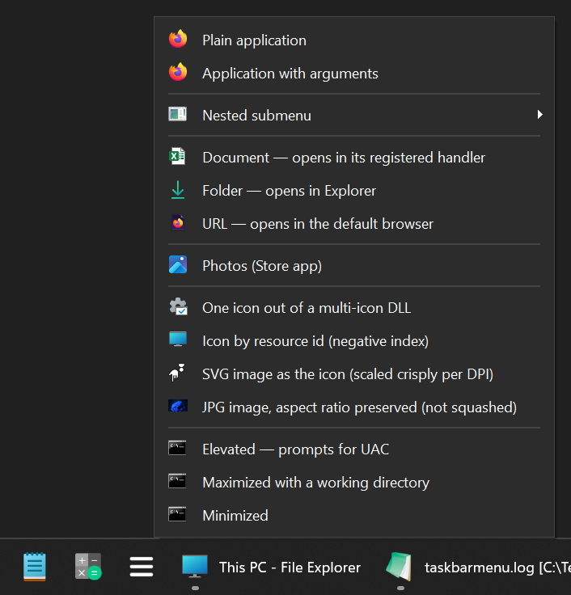
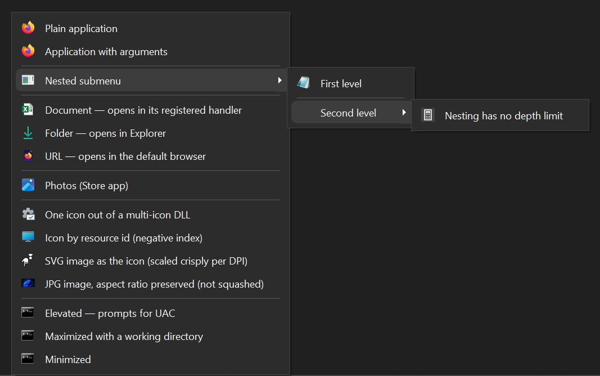
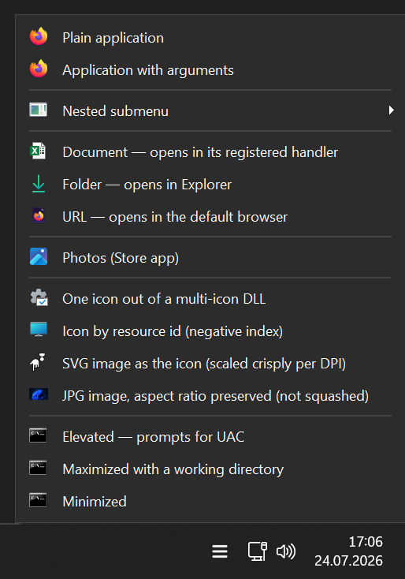
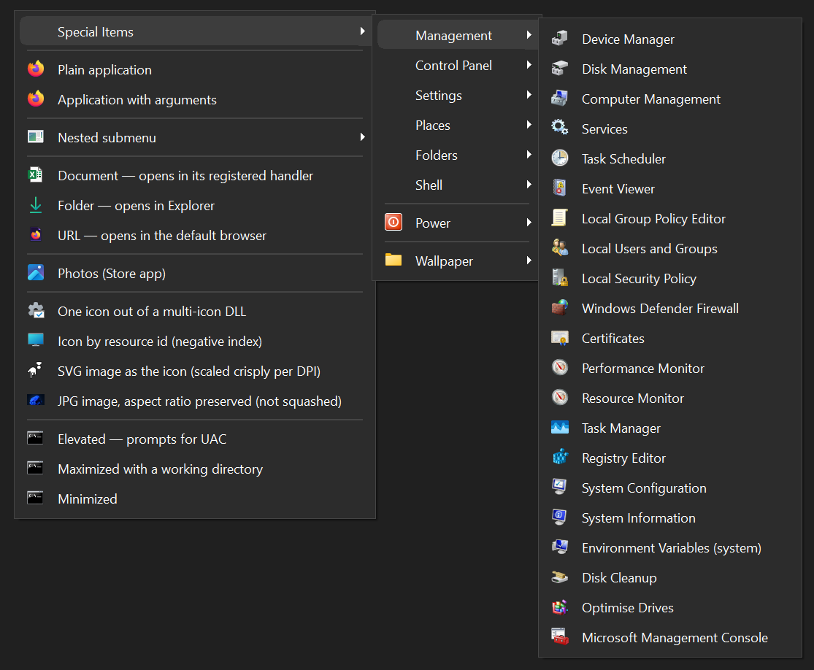

# Taskbar Menu

Launcher menu for the Windows 10/11 taskbar, driven by a single JSON file. Pin one button to
the taskbar, click it, and a popup menu of your applications, documents, folders and URLs opens
right there – a start menu you fully control.



*The image shows the menu, opened from its pinned button (the ≡ icon). The two buttons left of it are pinned launchers:
taskbar buttons that simply launch a new instance of an application on each click without becoming the window control
(see [Pinned launchers](#pinned-launchers)).*

## Five things to know

- **Dark mode, High DPI and Taskbar location agnostic.**
- Nested submenus, hot reload, per-entry working directory / elevation / window state.
- **~10 ms per click**, stays resident in the system tray.
- No dependencies, no external tools. One static binary.
- MIT licensed.

## Getting started

1. Download the latest release from the [Releases](../../releases) page, or [build from source](#building-from-source).
2. Create a `config.json` next to the exe. Start from [config.example.json](config.example.json).
3. Pin `TaskbarMenu.exe` to the taskbar.
4. Optional but recommended: put a shortcut to `TaskbarMenu.exe --background` in `shell:startup`,
   so the process is resident and the icons are already cached before the first click.

A sample `config.json`:

```json
{
    "$schema": "./config.schema.json",
    "items": [
        { "label": "Budget Spreadsheet", "exec": "C:\\Data\\Documents\\Budget.xlsx" },
        { "type": "separator" },
        { "label": "Firefox", "exec": "C:\\Program Files\\Mozilla Firefox\\firefox.exe" }
    ]
}
```

The config is read from `config.json` next to the exe, or from `--config <path>`.
`config.schema.json` ships alongside it, so an editor that honours `$schema` gives completion and
validation. [config.example.json](config.example.json) shows one of every supported feature.
It is also exactly the config the screenshots on this page were taken with.

## Configuration

### Top level

| Key | Default | Meaning |
|---|---|---|
| `trayIcon` | `true` | Show a notification-area icon. The process stays resident either way. |
| `iconSize` | `16` | Icon edge length at 100 % scaling; scaled per monitor DPI. |
| `theme` | `"auto"` | `auto` \| `dark` \| `light`. `auto` follows the system and updates without a restart. |
| `anchor` | `"taskbar"` | `taskbar` sits flush against the taskbar edge; `cursor` opens at the exact pointer position. |

### Entries

| Key | Default | Meaning |
|---|---|---|
| `label` | required¹ | Display text. |
| `type` | `"item"` | `item` \| `separator`. Unknown values are skipped with a warning, never fatal. |
| `exec` | – | An `.exe`, a document, a folder, a URL or a `.lnk`. |
| `appId` | – | AppUserModelID of a Microsoft Store app. See [Microsoft Store apps](#microsoft-store-apps). Alternative to `exec`. |
| `special` | – | A built-in Windows target named by a short id. See [Special entries](#special-entries). Alternative to `exec`. |
| `args` | `[]` | Arguments as separate strings; quoting is handled for you. |
| `icon` | auto | `.ico` path, or `file,index`. See [Icons](#icons). |
| `cwd` | – | Working directory. |
| `elevated` | `false` | Launch with the `runas` verb (UAC prompt). |
| `show` | `"normal"` | `normal` \| `minimized` \| `maximized` \| `hidden`. |
| `confirm` | depends | Only for a power action `special`. Ask before acting. See [Power actions](#power-actions). |
| `items` | – | Turns the entry into a submenu, at any depth. `exec` is ignored when present. |
| `openAll` | `false` | Adds an "Open all" entry above a submenu's own entries. See [Nested submenus](#nested-submenus). |
| `folder` | – | Turns the entry into a submenu listing of a directory. See [Folder submenus](#folder-submenus). |
| `depth` | `5` | How many directory levels a `folder` submenu descends (max 20). |
| `limit` | `200` | Maximum entries shown per level of a `folder` submenu (max 2000). |

¹ except for a separator, and for an entry with `special`, which brings its own label.

`label`, `exec`, `icon`, `cwd` and each `args` element expand `%VAR%` environment references. An unset
variable is left verbatim, so a typo shows up in the menu instead of silently vanishing.

## Features

### Documents, folders and URLs

`exec` is not limited to programs – anything with a registered default handler works:

```json
{ "label": "Budget",    "exec": "C:\\Data\\Documents\\Budget.xlsx" }
{ "label": "Downloads", "exec": "%USERPROFILE%\\Downloads" }
{ "label": "Emontis",   "exec": "https://emontis.io/" }
```

`args` are meaningless for these, the handler decides. If you need a *specific* application rather
than the registered one, name it in `exec` and pass the document in `args`:

```json
{ "label": "Notes", "exec": "C:\\Program Files\\Notepad++\\notepad++.exe",
  "args": ["C:\\Data\\notes.txt"] }
```

### Nested submenus

An entry with an `items` array becomes a submenu, at any depth:



Add `"openAll": true` to a submenu and it leads with an "Open all" entry that launches every entry
below it in one click:

```json
{ "label": "Morning Apps", "openAll": true, "items": [
    { "label": "Mail",   "exec": "C:\\Program Files\\Mozilla Thunderbird\\thunderbird.exe" },
    { "label": "Chat",   "exec": "C:\\Program Files\\Slack\\slack.exe" },
    { "label": "Browser", "exec": "C:\\Program Files\\Mozilla Firefox\\firefox.exe" }
] }
```

It reaches into nested submenus too, but not into a `folder` or `special` submenu.

### Microsoft Store apps

A Store (packaged) app has no `.exe` to point `exec` at. It is identified by an **AppUserModelID**
(AUMID) instead. Give that as `appId` and it launches through `shell:AppsFolder\<AUMID>`, the same
route Start uses:

```json
{ "label": "Microsoft Photos", "appId": "Microsoft.Windows.Photos_8wekyb3d8bbwe!App" }
```

Find an app's AUMID with PowerShell.
This lists the name and `AppID` of every Start-menu app, Store apps included:

```
Get-StartApps
```

`appId` is an alternative to `exec`; if both are set, `appId` wins.

The icon resolves automatically to the app's package logo.

### Icons

Omit `icon` and it is resolved automatically: an executable uses its own, a document gets its file
type's registered icon (`.xlsx` → Excel's, `.txt` → the shell's), a folder gets Explorer's, a URL gets
the default browser's.

To pick a specific one out of a file that holds several, append an index. A negative index is a
resource id.

```json
{ "icon": "C:\\Windows\\System32\\imageres.dll,109" }
{ "icon": "C:\\Windows\\System32\\shell32.dll,-16" }
```

`icon` may also be an **image file** rather than an icon resource: `.svg`, `.png`, `.jpg`, `.gif`,
`.bmp`, `.tiff`, and `.webp` / `.avif` / `.heic` where the matching OS codec is installed (the AV1 and
HEIF codecs are free Store extensions).

```json
{ "icon": "C:\\Data\\Icons\\logo.svg" }
{ "icon": "C:\\Data\\Icons\\banner.png" }
```

A non-square image keeps its aspect ratio: it is scaled to fit the icon box and centered on
transparency rather than squashed square. An image whose codec is missing (e.g. an `.avif` on a
machine without the AV1 extension) falls back to the generic icon, exactly like a missing `.dll`.
The menu item is never dropped.

Two helpers make the index findable rather than guesswork:

```
TaskbarMenu.exe --list-icons "C:\Windows\System32\imageres.dll"
TaskbarMenu.exe --pick-icon  "C:\Windows\System32\imageres.dll"
```

`--pick-icon` opens the standard Windows "Change Icon" dialog and prints a line ready to paste.

Icons are extracted at the exact pixel size the current monitor needs (16 px at 100 %, 24 at 150 %,
32 at 200 %) and cached per size, so moving between differently-scaled displays stays crisp.

### Pinned launchers

Besides the popup menu, you can pin **individual launchers** to the taskbar that behave like the
classic Windows launchers: each click starts a *new* instance of a target, and the button itself
never turns into a running-app entry. The two extra buttons in the screenshot at the top are such
launchers. They are defined in a separate `launchers` array: a flat list, disjoint from `items`,
since the set you pin is usually not the set you keep in the menu:

```json
{
  "launchers": [
    { "id": "firefox", "label": "Firefox", "exec": "C:\\Program Files\\Mozilla Firefox\\firefox.exe" },
    { "id": "firefox-work", "label": "Firefox (Work)",
      "exec": "C:\\Program Files\\Mozilla Firefox\\firefox.exe",
      "args": ["-profile", "C:\\Data\\Profiles\\work"] }
  ]
}
```

A launcher entry takes the same launch fields as a menu entry (`exec` / `appId` / `args` / `icon` /
`cwd` / `elevated` / `show`) plus a required **`id`**:

| Key | Default | Meaning |
|---|---|---|
| `id` | required | Stable key. `--launch <id>` resolves it and the generated shortcut's AppUserModelID is built from it. Also the `.lnk` file name. |
| `label` | – | Display text for the shortcut; also accepted by `--launch` as a fallback key. |
| `exec` / `appId` / `special` / `args` / `icon` / `cwd` / `elevated` / `show` | – | Same meaning as a menu entry. |

Generate the shortcuts and pin them:

```
TaskbarMenu.exe --make-launchers            write a .lnk for every launcher into .\Launchers
TaskbarMenu.exe --make-launcher firefox     write just one
TaskbarMenu.exe --make-launchers --out D:\Pins
```

Then drag a generated `.lnk` onto the taskbar. Each shortcut runs `TaskbarMenu.exe --launch <id>`,
which starts the target and exits without a window, so the pinned button stays a launcher instead of
becoming a running app.

### System tray

With `trayIcon` enabled (the default), the resident instance also shows a notification-area icon.
A left click opens the same launcher menu at the cursor; a right click opens a small maintenance
menu with *Reload config*, *Edit config…* and *Exit*. The tooltip shows the config's filename, so
multiple instances (each serving a different `--config`) stay tellable apart.



### Dark mode

With `theme` set to `auto` (the default), the menu follows the system light/dark setting and
switches live, without a restart; `dark` and `light` force one.

### Special entries

There are special entries available for most of Windows' own tools like the device manager, task manager, Windows settings and so on:

```json
{ "special": "deviceManager" }
{ "special": "taskManager" }
{ "special": "windowsUpdate" }
{ "special": "recycleBin" }
```

That is a *complete* entry. The label and the icon come from the catalog, so `special` is the only
key required. Set `label` or `icon` yourself to override either:

```json
{ "special": "deviceManager", "label": "Geräte-Manager" }
{ "special": "environmentVariables", "label": "Environment Variables (System)", "elevated": true }
```

`special` is a third way to name a target, alongside `exec` and `appId`; if more than one is set,
`special` wins. It works in `launchers` too, so a system tool can be pinned to the taskbar:

```json
{ "launchers": [ { "id": "devicemanager", "special": "deviceManager" } ] }
```



#### Catalog

Print the catalog:

```
TaskbarMenu.exe --list-specials
```

| Group | IDs |
|---|---|
| Management | `deviceManager` `diskManagement` `computerManagement` `services` `taskScheduler` `eventViewer` `gpedit` `localUsers` `secpol` `firewall` `certificates` `perfmon` `resourceMonitor` `taskManager` `regedit` `msconfig` `systemInfo` `environmentVariables` `diskCleanup` `defrag` `mmc` |
| Control Panel | `controlPanelHome` `systemProperties` `networkConnections` `programsAndFeatures` `displayControl` `mouse` `soundControl` `internetOptions` `dateTime` `securityMaintenance` `bluetoothControl` `userAccounts` |
| Settings | `settings` `windowsUpdate` `installedApps` `displaySettings` `soundSettings` `bluetoothDevices` `networkSettings` `defaultApps` `powerSettings` `storage` `about` `printers` |
| Places | `recycleBin` `thisPC` `userProfile` `networkFolder` `fonts` `startup` `sendTo` `temp` |
| Folders | `startMenu` `windowsTools` `desktop` `documents` `downloads` `pictures` |
| Shell | `allApps` `drives` `controlPanel` `allSettings` |
| Power | `lock` `signOut` `sleep` `hibernate` `restart` `shutdown` |

IDs are matched case-insensitively. An unknown id is skipped with a warning rather than failing the
file, so a config written for a newer build still opens.

Two things worth knowing:

- **Not every tool exists on every edition.** `gpedit` and `secpol` are absent on Windows Home.
  `--config-check` reports `[target not found]` for those; the entry still appears in the menu.
- **Labels are English** regardless of the system language, because resolving the localised name
  would cost a shell call per entry and make `--config-check` print differently on every machine. Set
  `label` to translate one.

### Folder submenus

`folder` turns an entry into a submenu of a directory's contents:

```json
{ "label": "Repos", "folder": "C:\\Data", "depth": 2 }
{ "folder": "%USERPROFILE%\\Downloads" }
```

The listing is read **when the submenu is opened**, not at startup, so it always shows what is there.

The submenu leads with an **Open …** item and a separator, so the folder itself is still one click
away. Directories come first, then files, each alphabetical. Hidden and system entries are
skipped, as are junctions and symlinks.

Six special entry catalog IDs are folder submenus over well-known locations:

```json
{ "special": "startMenu" }
{ "special": "windowsTools" }
{ "special": "desktop" }
```

`startMenu` and `desktop` each merge **two** directories (the per-user one and the all-users one)
the way Explorer presents them, so `Accessories` appears once containing everything, not twice
half-empty.

Two limits keep a mistake from freezing the menu, since the popup cannot repaint while it is being
filled:

- `limit` (200 per level): anything beyond it becomes a clickable **More…** entry that opens the
  folder in Explorer, so the overflow is a door rather than a dead end.
- A half-second deadline and a 2000-node ceiling per submenu opening. This is what stops a `folder`
  pointing at a disconnected network share from hanging the menu; you get the truncation entry
  instead.

### Shell submenus

Four submenus list things that are not directories at all, so they cannot come from `folder`:

```json
{ "special": "allApps" }        // every installed application, Store apps included
{ "special": "drives" }         // the drive list, with volume labels
{ "special": "controlPanel" }   // the classic Control Panel applets
{ "special": "allSettings" }    // the modern Settings pages, in eight groups
```

Enumerating the app list takes 100–300 ms, and a menu cannot repaint while it is being filled, so
the result is cached for five minutes. *Reload config* from the tray clears it (which is also the
answer to "I just installed something and it is not in the list").

### Power actions

Six of the specials are power actions:

```json
{ "special": "lock" }
{ "special": "signOut" }
{ "special": "sleep" }
{ "special": "hibernate" }
{ "special": "restart" }
{ "special": "shutdown" }
```

They require confirmation by default if they would close work:

| | Default |
|---|---|
| `signOut`, `restart`, `shutdown` | needs confirmation: everything you have open gets closed |
| `lock`, `sleep`, `hibernate` | acts immediately: fully reversible, nothing is closed |

`confirm` overrides either direction:

```json
{ "special": "shutdown", "confirm": false }   // no prompt, one click
{ "special": "lock",     "confirm": true }    // prompt even for this
```

Power actions work as launchers too, so "Shut Down" can be a taskbar button:

```json
{ "launchers": [ { "id": "shutdown", "special": "shutdown" } ] }
```

## Command line

```
TaskbarMenu.exe                        show the menu (starts the resident server on first run)
TaskbarMenu.exe -b, --background       stay resident without showing the menu (use at logon)
TaskbarMenu.exe -c, --config <path>    use a different config file
TaskbarMenu.exe --config-check         validate the config, print the menu tree, exit
TaskbarMenu.exe --config-format        pretty-print the config file in place, exit
TaskbarMenu.exe --list-icons <file>    how many icons a file holds
TaskbarMenu.exe --pick-icon  <file>    open the Windows icon picker
TaskbarMenu.exe --list-specials        list the built-in "special" entry ids
TaskbarMenu.exe --launch <id>          start one launcher entry (what a pinned shortcut runs)
TaskbarMenu.exe --make-launcher <id> [--out <dir>]   write one pinnable .lnk
TaskbarMenu.exe --make-launchers     [--out <dir>]   write a .lnk for every launcher
TaskbarMenu.exe -h, --help
TaskbarMenu.exe -v, --version
```

## How it works

The first run becomes the server: it creates a hidden top-level window, loads the config, extracts the
icons, adds the tray icon and runs a message loop. Every later run finds that window, hands over its
foreground privilege, posts the cursor position and exits.

Notes on the parts that are easy to get wrong:

- **One server per config.** The resident instance is identified by the config file it serves: the
  window class and the startup mutex are both suffixed with a hash of the config path. A launch only
  reuses a server when it targets the same config, so you can pin several buttons, each with its own
  `--config <path>`, and every one gets its own resident menu and tray icon. Two launches naming the
  same file (in any letter case) still share the one server.
- **Taskbar location.** A bottom taskbar opens the menu up-and-right, a right taskbar left-and-down,
  a left taskbar right-and-down and a top taskbar down-and-right. The the menu never overlaps it.
- **DPI.** `SetProcessDpiAwarenessContext(PER_MONITOR_AWARE_V2)` runs before any window exists, which
  removes the need for an application manifest and therefore for any resource tooling. The menu is
  rebuilt whenever the DPI changes, because `WM_MEASUREITEM` is only sent the first time a menu is
  displayed. A menu built at 96 DPI would otherwise keep its old item sizes on a 192 DPI monitor.
- **Dark mode.** Menu *items* are owner-drawn, so their colours are always correct. The menu
  *window* (its background and padding) is painted by Windows and stays light in dark mode unless
  asked otherwise, so it is darkened via the documented `SetMenuInfo` route (`hbrBack`). Setting a
  background brush disables theming for the menu, trading Windows 11's rounded corners for a flat
  rectangle. That trade also leaves the popup's 1px nonclient border at its classic light-gray
  colour, which stands out against a dark fill. A thread-local `WH_CBT` hook catches every popup
  window created while the menu is on screen (the top-level menu and any open submenu alike) and
  repaints that border in the same subtle grey used for separators, so it blends with the fill
  instead of outlining it.
- **Hot reload** compares the config's mtime and size on every show, about 50 µs. No watcher goroutine,
  and it cannot miss an edit.
- **Config errors** never produce an empty menu: the parse error, with its line and column, becomes a
  clickable item that opens the file.

Set `TASKBARMENU_LOG=1` to log startup and reloads to `%TEMP%\taskbarmenu.log` (or set it to a path).

### Source layout

```
build.cmd                 build + icon/version stamp
VERSION                   release version, single source of truth for build.cmd and CI
config.example.json       one of every supported feature; template for your config.json
config.schema.json        JSON Schema for editor support
.github/workflows/
  ci.yml                  vet, test and build on every push and pull request
  release.yml             on a v* tag: build, package, publish to Releases
app-icon/
  icon.svg                vector source for the icon
  icon.ico                the exe's own icon, generated from icon.svg
  make-icon.cmd           rasterizes icon.svg into icon.ico
src/
  main.go                 startup, single instance, message loop, CLI
  win32.go                syscall bindings and struct layouts
  config.go               JSON model, validation, change detection
  format.go               --config-format: order-preserving pretty printer for config.json
  special.go              the "special" catalog of named Windows targets
  power.go                lock / sign out / sleep / restart / shut down
  dynamic.go              folder submenus enumerated when opened
  shellenum.go            shell-namespace listing (all apps, drives, ...)
  menu.go                 node tree and HMENU construction
  place.go                monitor, DPI and taskbar-edge resolution
  draw.go                 owner-draw rendering, palette, fonts
  border.go               dark-mode border repaint via a WH_CBT hook
  icons.go                icon resolution, extraction, cache
  image.go                image-file icons (WIC raster + Direct2D SVG)
  launch.go               ShellExecuteEx and argument quoting, --launch shim
  shortcut.go             pinnable .lnk generation with a stable AppUserModelID
  tray.go                 notification icon
  seticon/                post-build icon injection, builds as SetIcon.exe
  dist/
    readme.txt            plain-text readme, shipped inside the release archives
```

### Building from source

Requires only the Go toolchain (tested with 1.26.5).

```
build.cmd
```

Produces `bin\TaskbarMenu-AMD64.exe`, `bin\TaskbarMenu-ARM64.exe` and `bin\SetIcon.exe`.

```
go test ./src/...     # unit tests
go vet ./src/...
```

`SetIcon` is a small helper in [src/seticon/](src/seticon/) that stamps `app-icon\icon.ico` and a
VERSIONINFO resource into the finished exe with `UpdateResource`. The Go toolchain has no resource
compiler, so this approach is used.

`icon.ico` itself is generated from [app-icon/icon.svg](app-icon/icon.svg), the vector
source for the icon. To change the design, edit the SVG and regenerate:

```
app-icon\make-icon.cmd
```

This rasterizes the SVG at each size Windows expects (16 through 256 px) directly from the vector
rather than downscaling a single render, and packs the result into `app-icon\icon.ico`. It
requires [ImageMagick](https://imagemagick.org) (with SVG support) on `PATH`; `build.cmd` does not
depend on it, only icon design changes do.
